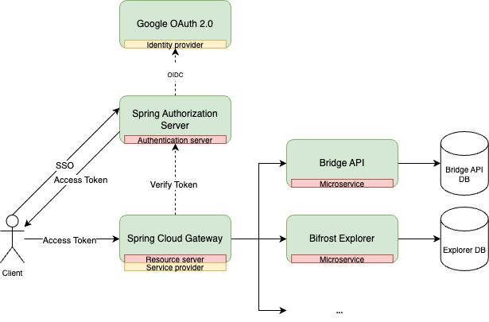

Created and maintained the Bifrost API Service — a single entry point through which external clients reach
the internal microservices in Bifrost's ecosystem, enabling cross-chain swaps.

- **Built and owned it end to end**, in Kotlin on Spring Cloud Gateway.
- **Designed the architecture** for secure, scalable communication between internal microservices.
- **Secured it with OAuth2**, keeping client credentials and user data confidential.
- **Wrote and maintained the API documentation** on [readme.com](https://readme.com/), covering endpoint
  selection through to client-facing tutorials.
- **Released roughly every two weeks**, keeping the gateway current as the services behind it changed.
