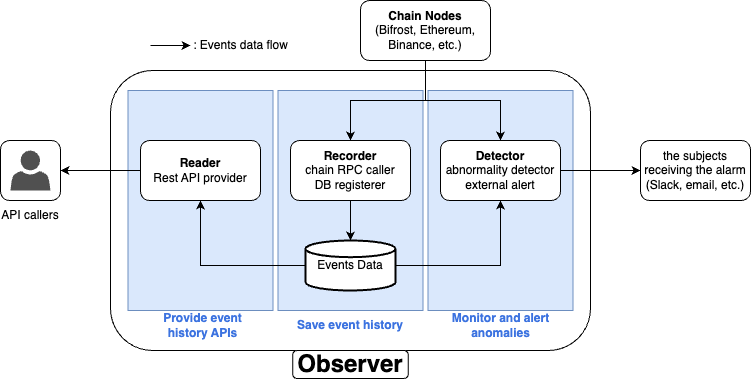

Built and maintained the Multichain Observer, a core piece of the BIFROST Network's infrastructure.
It does three things: records event data from Bifrost Bridge contracts, serves that data over a REST API, and flags abnormal conditions in the bridge.

- **Sole owner** of the service, in Python 3 on FastAPI with uvicorn.
- **Persisted bridge contract events** to MariaDB, structured for reliable retrieval.
- **Aggregated and exposed the data** through a REST API used by internal systems.
- **Detected anomalies** in the bridge, so irregularities could be caught before they became incidents.
