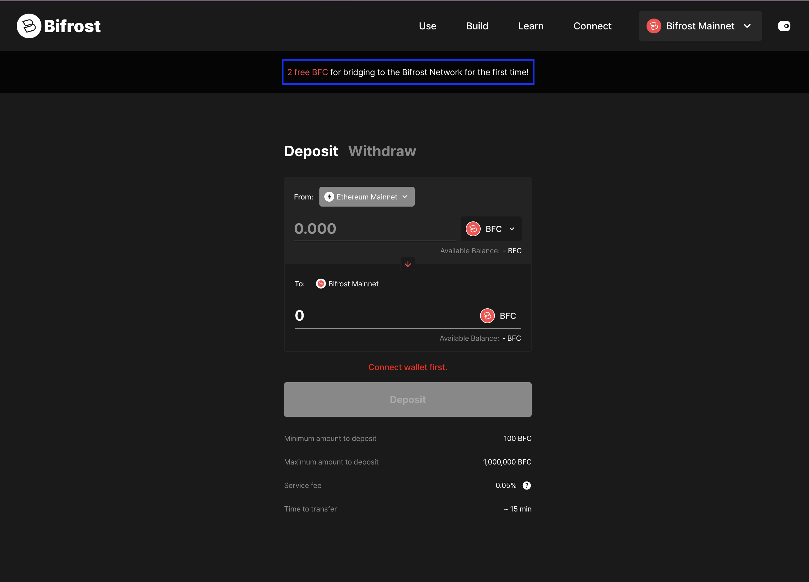

A scheduled Python job that finds new [Bifrost Bridge](https://www.bifrostnetwork.com/bridge) users and airdrops them native coin.
The difficulty wasn't the transfer — it was detecting new addresses across several EVM chains quickly, then getting the airdrops out reliably on each of those chains.

## Design

Two concurrent threads, deliberately running at different intervals:

- **Newcomer detection** — every 12 seconds, looking for addresses new to the bridge.
- **Airdrop** — every minute, batch-transferring BIFROST coin to whatever accumulated.

Detecting far more often than airdropping is what makes the batching work: one transaction covers many recipients, so the gas cost per user falls sharply.

## Outcome

The job was still running without error when I left in April 2025, delivering 2 free BFC to every new user.
