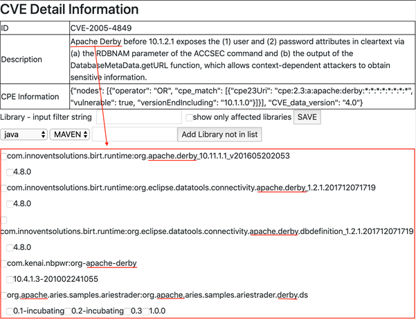
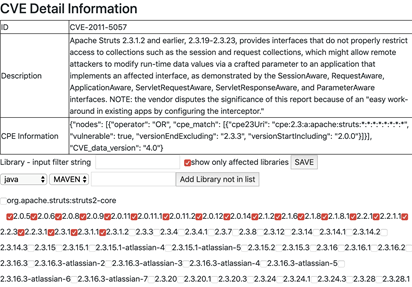
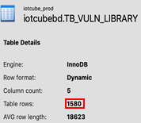

A Named Entity Recognition model that locates product names in a CVE's description text. Those names then
drive SQL queries suggesting which products in the database the CVE might affect.

## Why not just read the CPE field?

CVE and CPE records aren't reliably in sync — plenty of CVEs are missing their CPE data entirely. The
description, on the other hand, always says what kind of vulnerability exists in which product.

## Why NER, rather than matching against a list of product names?

Two reasons. New products get their first CVE every day, so a dictionary needs constant manual updating.
And the product name's position in the sentence varies — some descriptions open with the product, others
with the vulnerable version or the vendor.

## What I tried

Two open-source NLP toolkits, on a hand-built training set:

- **Apache OpenNLP** (Java API, Apache 2.0)
- **Stanford NLP** (Java and Python, GPL v2)

## Results

Neither was usable as-is, and they failed in opposite directions:

- **OpenNLP** — false positives, pulling in common nouns.

  

- **Stanford NLP** — false negatives, detecting no products at all.

  
