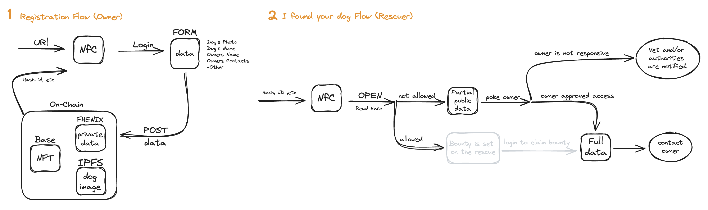

**1st place, Best use of Fhenix Stack, ETHGlobal Brussels 2024.**

Pet identification systems are regional. Take the animal outside the issuing region and its identity stops
resolving. Pet ID puts that identity on-chain instead, so it travels with the animal.

## My contribution

Designed the identity system and led the team. The design drew Fhenix's interest for potential grant
funding.

- Scoped two problems tight enough to build in a hackathon: an owner registering their pet, and a stranger
  finding a lost pet and needing to reach the owner.
- Designed the user flow for both, then picked technology against it rather than the reverse:
  - **Private data on-chain, still private** — Fhenix's FHE-enabled chain for encryption.
  - **Photos** — Filecoin/IPFS, since images don't belong in contract storage.
  - **Public per-pet identity** — NFTs on Base, for speed, low gas, and OpenSea compatibility.
- Configured the Fhenix chain in Dynamic wallet.
