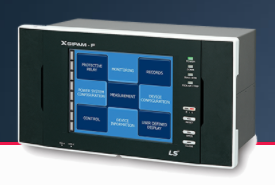

Our team assessed the vulnerability level of XGIPAM, a factory monitoring device. I owned the software
analysis.

I mapped the program structure, its software layers and the libraries it depends on. From there I worked
the vulnerability surface two ways: known CVEs in the libraries it pulls in, and white-box testing via
code clone detection.
